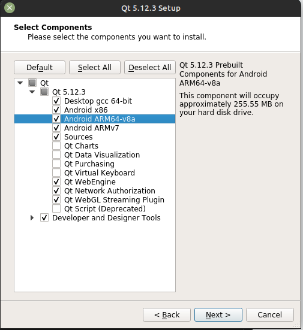

# ReadMe
## Client

# How to cross compile Qt5 for Rasbperry Pi 3 with remote debugging

## Introduction 
This is a gudie to cross compile Qt5 code for Raspberry pi 3 using Linux PC. 
Once you have finished you will be able to write code with Qt as nomally would.
When you want to build ready to buildt it for the Raspberry Pi, then just select the build option for Raspberry and then compile for the Pi. The guide follows [Heavy Bare Metal](http://heavybaremetal.com/index.php/blog/6-how-to-cross-compile-qt-5-for-raspberry-pi-3)'s guide. 

## Install Reaspberry Pi OS (Buster)
First you have to install the [Raspberry image (Buster)](https://www.raspberrypi.com/software/operating-systems/) with desktop. The image is the legacy image. After that you have get it on WIFI and then enable ssh in Raspberry Pi Configuration. Then run the command 
```bash
ifconfig
```
And then find the ip for the wlan0. It's under the inet. For me it is 
```bash
172.16.0.7
```
Then connect thourgh SSH
```bash
ssh <username>@<pi ip adress>
```
```bash
ssh pi@172.16.0.7
```
**If it won't work** then use the ssh-kygen command
```bash
ssh-keygen
```
You are going to connect to the pi thourgh SSH a few time. So you may wish to enable key based login without a password. So if you run the command.
```bash
ssh-copy-id <username>@<pi ip adress>
```
**If** you are not out of the pi when you run the command. So run **exit** and then run the command above. Now you have ssh access to the Raspberry Pi.

### In Raspberry
The first thing you wanna on is run the command below, and the remove the '#' on the third line as you can see in the teminal output to step below. It will enable the deb-src. 

```bash
sudo nano /etc/apt/sources.list
```

```bash
eb http://raspbian.raspberrypi.org/raspbian/ buster main contrib non-free rpi
# Uncomment line below then 'apt-get update' to enable 'apt-get source'
deb-src http://raspbian.raspberrypi.org/raspbian/ buster main contrib non-free $
```

Now you have to update the Pi with the command
```bash
sudo apt update && sudo apt full-upgrade -y && sudo apt autoremove -y
```
If there was installed any package you will have to reboot 
```bash
sudo reboot
```
Now the normal setup for the Raspberry Pi is done. 

## Install all software and tools needed in Linux 
Now we will install the varios Qt and graphics libraries for building Qt code for the Pi. If you just un the following commands it will be done. 
```bash
sudo apt build-dep qt4-x11 -y
```
```bash
sudo apt build-dep libqt5gui5 -y
```
```bash
sudo apt install -y libudev-dev libinput-dev libts-dev libxcb-xinerama0-dev libxcb-xinerama0
```
```bash
sudo mkdir /usr/local/qt5pi
```
```bash
sudo chown pi:pi /usr/local/qt5pi
```
```bash
sudo rpi-update
```
```bash
sudo reboot
```

## Create a sysroot folder in the Linux, that will synchronize the Pi and the Linux
Now we need to synchrnize the Linux with the Pi. We will be creating the directiory "raspy" in the home directory to hold the development tools and the sysroot that will be created, to mirror files form the Pi. Firstly we want to get the Raspberry Pi tools, to create out sysroot. 
### In the Linux
```bash
sudo apt update && sudo apt full-upgrade -y && sudo apt autoremove -y
```
```bash
mkdir ~/raspi && cd ~/raspi
```
```bash
sudo apt install git python python3 -y
```
```bash
git clone https://github.com/raspberrypi/tools
```
```bash
mkdir sysroot sysroot/usr sysroot/opt
```
Now we can generalise the ip adress for the Raspberry using the command below, but if you havn't create a ssh-key for the Raspberry run the command and press enter 3 times and password for the Pi. 
```bash
ssh-keygen
```
```bash
export PI_IP=<pi IP adress>
```
Then run the command and press enter. 
```bash
ssh-copy-id pi@$PI_IP
```

Now we want to synchronize the Raspberry folders to the Linux PC with the following commands. You can skip the PI_IP and just use the Raspberry Pi  IP adress. 

```bash
rsync -avz pi@$PI_IP:/lib sysroot
```
```bash
rsync -avz pi@$PI_IP:/usr/include sysroot/usr
```
```bash
rsync -avz pi@$PI_IP:/usr/lib sysroot/usr
```
```bash
rsync -avz pi@$PI_IP:/opt/vc sysroot/opt
```
Note: There may be one or two errors, due to symbolic links and such, this won’t matter.

There is a mistake in one of the scripts, so we have to fix that one before we continues. The mistake is just instaed of make = it is make == a few places. Kukkimonsuta has fixed the script, so we just get it from his github. 
```bash
wget https://raw.githubusercontent.com/Kukkimonsuta/rpi-buildqt/master/scripts/utils/sysroot-relativelinks.py

```
```bash
chmod +x sysroot-relativelinks.py

```
```bash
./sysroot-relativelinks.py sysroot
```
## Build Qt from source, and any Qt modules we migth need 
Now we need to install the Qt. We will be using the 5.12.3 version, because that one works. But before we install Qt we have to install some libraries and utilies for later use. 
### On the Linux
```bash
sudo apt install -y libgl1-mesa-dev libglu1-mesa-dev mesa-common-dev libxkbcommon-x11-0
```
```bash
sudo apt-get install -y lib32z1
```
```bash
sudo apt-get install -y libxcb-xinerama0-dev
```
```bash
sudo apt-get install -y flex bison gperf libicu-dev libxslt-dev ruby
```
```bash
sudo apt-get install -y libssl-dev libxcursor-dev libxcomposite-dev libxdamage-dev libxrandr-dev libfontconfig1-dev libcap-dev libxtst-dev libpulse-dev libudev-dev libpci-dev libnss3-dev libasound2-dev libxss-dev libegl1-mesa-dev gperf bison
```
Now we got the libraries and the utilities we can install the Qt
```bash
cd ~/Downloads
```
```bash
wget http://download.qt.io/official_releases/qt/5.12/5.12.3/qt-opensource-linux-x64-5.12.3.run
```
```bash
chmod +x qt-opensource-linux-x64-5.12.3.run
```
```bash
./qt-opensource-linux-x64-5.12.3.run
```
Note: That in Qt you need to have a account. You also need to check all of these thing off.



## Copy the Qt libraries over to the Pi

## Build a Qt example, and deploy and run it on the Pi

## Change the Server Projekt to be able to cross compile

## Run the Server with Qt
